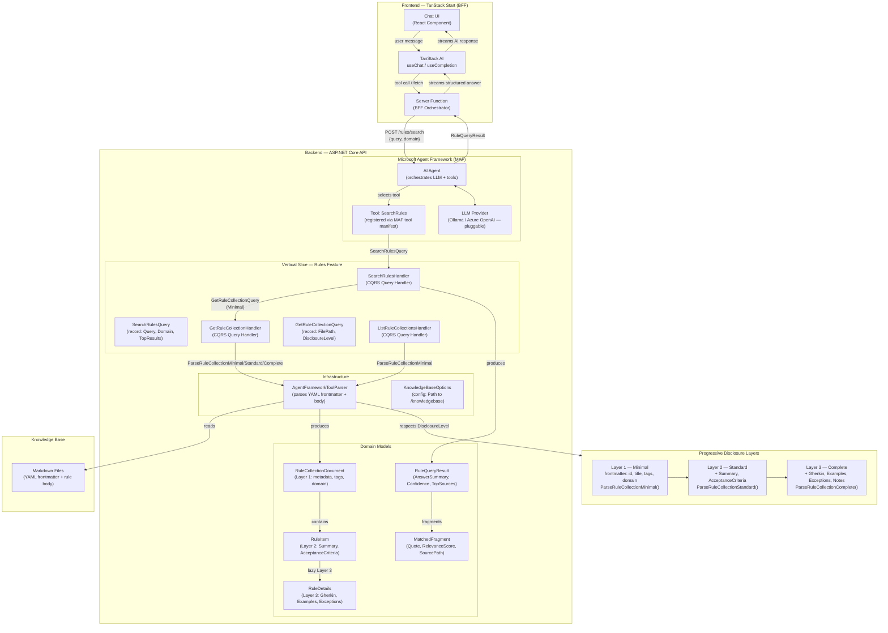

# Architecture Diagram

Full system flow: TanStack Start (BFF) → ASP.NET Core API → Microsoft Agent Framework → Knowledge Base, with progressive disclosure via `AgentFrameworkToolParser`.

## Flow Summary

1. **User types a question** → `Chat UI` → `TanStack AI` (`useChat`)
2. **TanStack AI calls** the BFF **Server Function**, which POSTs to the .NET API
3. **MAF Agent** receives the request, picks the `SearchRules` tool based on LLM reasoning
4. **Tool invokes** `SearchRulesHandler` with a `SearchRulesQuery` (CQRS record)
5. **Handler delegates** to `GetRuleCollectionHandler` / `AgentFrameworkToolParser` per file
6. **Parser applies the `DisclosureLevel`** — `Minimal` for fast scan, `Standard` for summaries, `Complete` for full details — reading the markdown KB files
7. **Domain models** (`RuleCollectionDocument` → `RuleItem` → `RuleDetails`) carry only what was requested
8. **`RuleQueryResult`** (with `AnswerSummary`, `Confidence`, `SupportingMatches`) flows back up to the Agent → API → Server Function → TanStack AI → streamed to the UI
